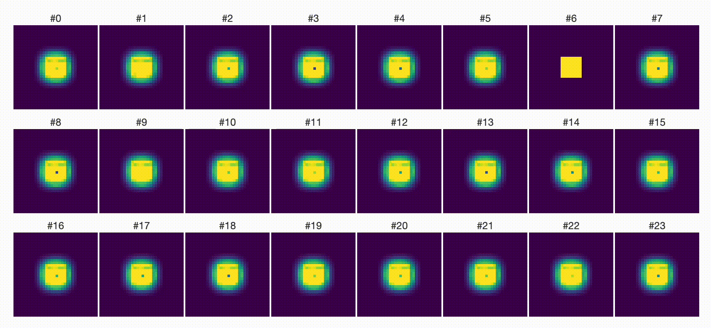

## Artificial Life In Cellular Encoding

**Emergent Structures noisy channel message passing with an NCA**

- [🛝 Slides Presented at ALICE 2026](https://docs.google.com/presentation/d/1Oq30wTO-09B-4H93yZqvRRwuLmzqTTj888eYLTN5fSM/edit?usp=sharing)
- [🐇 ALICE26 Workshop Website](https://aliceworkshop.org/)
- [⚠️ Project website WIP](https://www.izhv.eu/vitascopic-nca/)

**Sample of robust generations**

### What is our project about?

- What is life?
  - I know it when I see it
- How does life look like?
  - From the point of view of **Information Theory**
  - **Some machinery that preserves information in a noisy environment**

**Our approach in a diagram**

- We start with a random message/dna
- We put it as a seed in the initial NCA grid state
- Run the NCA
- Apply differentiable noise (gaussian/translation/rotation/structured noise, etc)
- Decode the message
- Supervise on the decoded message and the initial message.

**Intuition**

The NCA has to learn to generate morphologies that are robust to the noise.
The DNA information has to be encoded in the form and robust to perturbations.

**Features of life the system exhibits**

- Preserves low-entropic information 
- Homeostasis (stable under prolonged/repeated noise additions)

**Further Work**

- Respond to stimuli
- Reproduction
- Adaption (Perturbations in the noise pattern)
- Multi-species
- Get published in Nature

> Brought to you by the **chia** team ❤️
